# TomCat VI

**A Discord bot for the people looking after the cats at UT Arlington.**

TomCat helps Campus Cat Coalition keep track of feeding rounds, find photos of familiar cats, identify animals in new pictures, and keep the club's records in order. It grew out of the day-to-day work of running a campus cat rescue: remembering who fed which station, finding a substitute, and figuring out whether the cat in someone's photo is Microwave.

This repository contains the Python bot, its volunteer web interface, and the computer vision tools behind its photo library. It runs in the club's private Discord server.

<p align="center">
  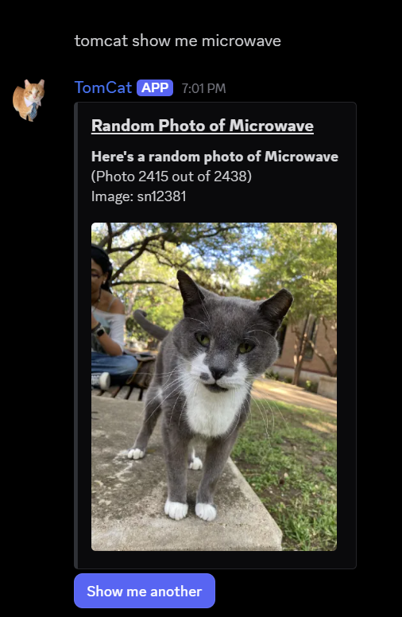
  &nbsp;&nbsp;
  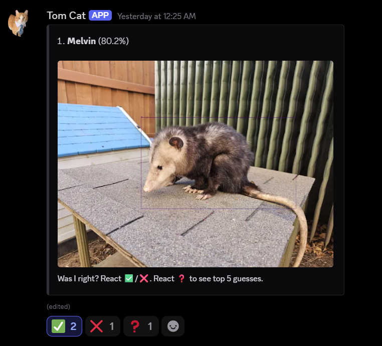
</p>
<p align="center"><sub>Real Discord responses. Human usernames and avatars are removed from the photo request. And yes, the photo library includes an opossum.</sub></p>

[Computer vision](#computer-vision) · [Training results](#training-results) · [Run it yourself](#run-it-yourself) · [Code map](#code-map)

## What it does

- **Feeding coordination.** Records completed rounds, manages schedules and substitute requests, and posts reminders for stations that still need food.
- **Cat profiles and photos.** Looks up individual cats, serves random photos, and crops images using the detector. A local cache keeps repeat requests quick.
- **Photo identification.** Detects animals, compares their image embeddings against a reference gallery, and returns ranked identities. Members can react to correct a guess or ask for the top five.
- **Dues and bookkeeping.** Reads payment notifications from the club mailbox, matches dues to members, assigns membership roles, and records financial activity in Google Sheets.
- **Moderation and records.** Flags likely spam and keeps daily text logs alongside structured event logs.

<p align="center">
  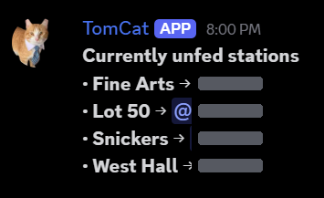
</p>
<p align="center"><sub>The less glamorous part of the bot is also one of the most useful. Volunteer mentions are redacted.</sub></p>

## How it fits together

Messages go through a rule-based intent router with aliases, fuzzy matching, and recent-message context. That lets TomCat handle requests such as `tomcat show me microwave`, including cases where someone sends a photo and its accompanying text separately. There is no LLM in the command-routing path.

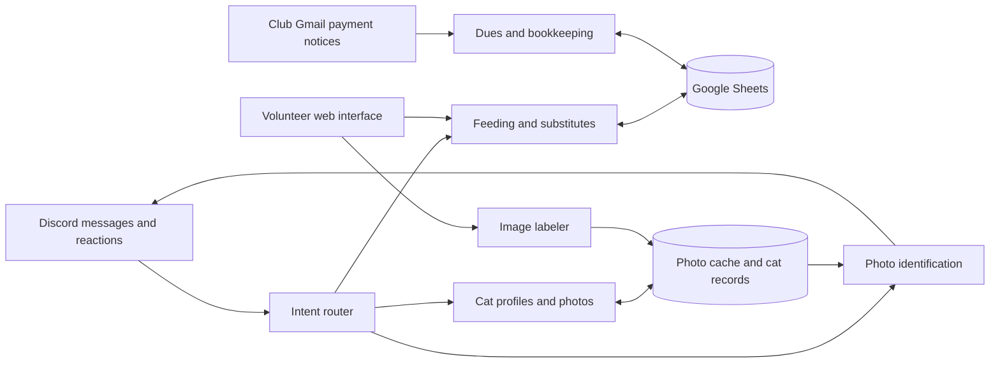

The browser interface covers schedules, substitute requests, feeding checklists, and image labeling. The labeler supports editing boxes and identities, with YOLO detection and SAM2 box refinement to help prepare the reference data. Gallery update tools turn labeled crops into reference embeddings.

## Computer vision

Finding an animal and recognizing an individual are separate steps:

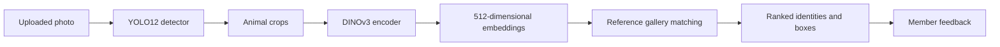

The current encoder wrapper uses **DINOv3 ViT-L/16** with a 512-dimensional embedding head. It compares crops with labeled reference images rather than asking the detector to predict each cat's name. The default detector is the custom **YOLO12s** checkpoint; the repository also includes notebooks for training a larger detector and the R6 encoder.

Detection and embedding can run locally or on a **Modal GPU** through the same backend interface. Gallery matching stays in the bot process. See the [vision implementation](tomcat/vision/vision.py), [backend interface](tomcat/vision/backend.py), and [Modal deployment notes](cloud/modal/README.md).

### A look inside the detector

<p align="center">
  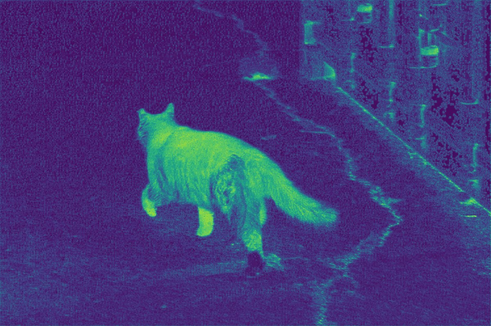
  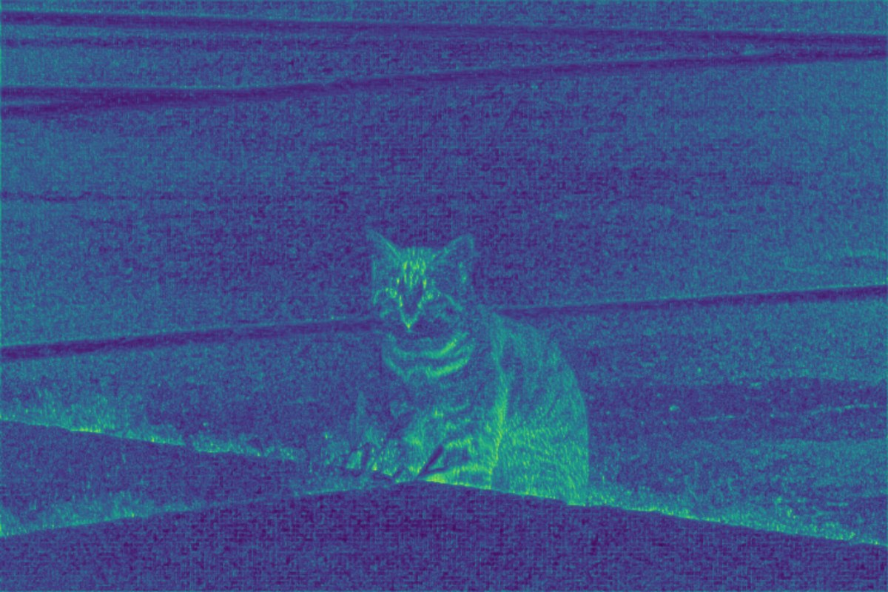
</p>

These are feature-map visualizations from the detector experiments. The accompanying visualization script averages an intermediate layer's channels and scales the result into a color map; its saved configuration taps layer index 4. Brighter areas represent larger averaged feature responses within that image.

They show structure the network responds to, including cats, edges, and background textures. They do **not** establish which pixels caused a final detection or identity prediction. That would require a prediction-specific attribution method, such as [Grad-CAM](https://arxiv.org/abs/1610.02391). The exact settings used for these two exports were not saved with the images; [the visual notes](docs/VISUALS.md) explain the provenance and limits.

## Training results

The supplied **SecondFullSmallTrain(BEST)** detector run used YOLO12s at an image size of **864**, with **125 logged epochs**. The row with the highest validation mAP@50–95 is epoch **114**:

| Validation metric | Epoch 114 |
| --- | ---: |
| Precision | 97.50% |
| Recall | 95.82% |
| mAP@50 | 98.40% |
| mAP@50–95 | 91.72% |

These measure **bounding-box detection of the cat class**, not recognition of individual cats. mAP@50 uses an intersection-over-union threshold of 0.50; mAP@50–95 averages across stricter thresholds from 0.50 to 0.95. These are the run's validation results, not a separate held-out test or a measurement of live Discord performance.

<p align="center">
  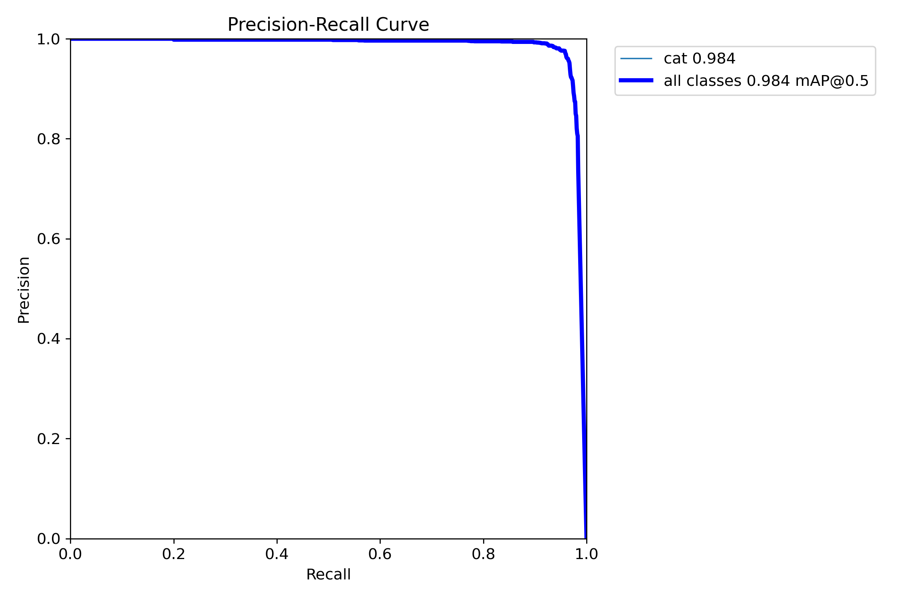
</p>

The [original epoch CSV](docs/training/detector-results.csv), [run configuration](docs/training/detector-args.yaml), and [loss and metric curves](docs/assets/detector-training.png) are included so the numbers can be checked.

<details>
<summary><strong>Earlier identity-recognition experiments</strong></summary>

These supplied plots are historical experiments, not benchmarks for the current R6 encoder. Their run IDs, checkpoints, and exact evaluation setup were not supplied, so they are kept separate from the detector results above.

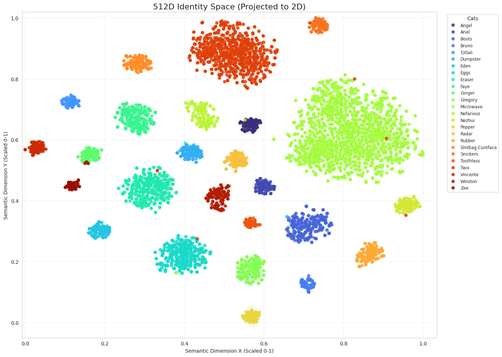

The projection shows groups of embeddings associated with different cats. Its two axes are projection coordinates, not named semantic properties. Without the projection method and evaluation split, visual separation alone does not establish recognition accuracy.

| Full validation plot | Balanced evaluation subset plot |
| --- | --- |
| 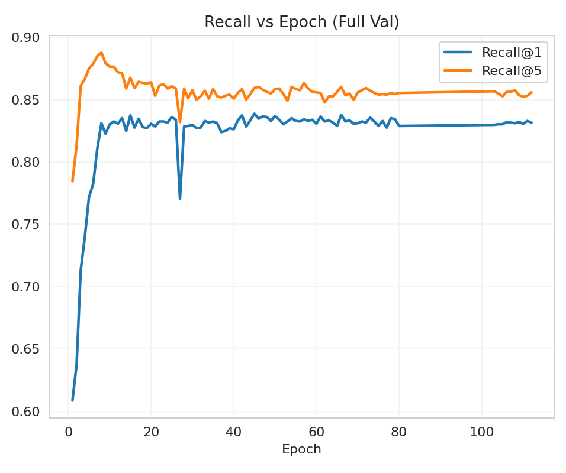 | 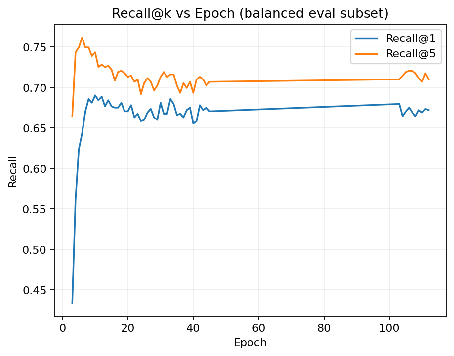 |

The full-validation plot ends near 83% Recall@1 and 86% Recall@5; the balanced-subset plot ends near 67% and 71%. These are approximate readings from images. The plots should not be assumed to share a checkpoint or evaluation protocol. Long straight segments connect plotted observations and do not demonstrate that every intervening epoch was evaluated.

</details>

## Run it yourself

TomCat is built around the club's Discord server, spreadsheets, and photo collection. Running another instance requires your own configuration, Google credentials, and model artifacts; the private data and trained weights are not bundled here.

Use **Python 3.11 or 3.12**. From the repository root, create and activate a virtual environment:

```bash
python -m venv .venv
```

```powershell
# Windows PowerShell
.\.venv\Scripts\Activate.ps1
```

```bash
# Linux / macOS
source .venv/bin/activate
```

Choose the dependency set for your host:

```bash
# CPU host, including a bot that offloads vision to Modal
python -m pip install -r requirements-droplet.txt

# Alternatively: Windows / NVIDIA local vision (CUDA 12.8 wheels)
python -m pip install -r requirements.txt
```

Local DINOv3 inference also needs `timm`, which is installed in the Modal image but is currently missing from the host requirements files:

```bash
python -m pip install "timm>=1.0.11"
```

1. Copy [`.env TEMPLATE`](.env%20TEMPLATE) to `.env` and fill in the Discord token, channel and role IDs, spreadsheet IDs, and Google credential paths. Review [the settings](tomcat/config.py) for the full configuration surface.
2. Enable the Discord application's message-content intent. Share the relevant Google Sheets with your service account and configure Gmail OAuth for the club mailbox if using payment processing.
3. Configure the web interface's Discord OAuth settings, session secret, and allowed origins if you want to use the volunteer UI.
4. Supply a detector, an **R6-compatible encoder**, and a gallery built with that encoder. Set paths explicitly; some configuration defaults still refer to older encoder generations:

   ```dotenv
   CV_BACKEND=local
   CV_DETECT_WEIGHTS=weights/984_917_yolo12s.pt
   CV_ENCODER_WEIGHTS=weights/R6_cat_DINOv3_encoder.pth
   CV_GALLERY_PATH=weights/R6_cat_DINOv3_gallery.pt
   CV_SAM_WEIGHTS=weights/sam2_s.pt
   ```

   SAM2 is used for labeler box refinement. For remote inference, follow [the Modal setup](cloud/modal/README.md) and set `CV_BACKEND=modal`.

5. Start the bot:

   ```bash
   python scripts/start.py
   ```

The launcher uses `.venv`. Windows development can also start the configured Cloudflare tunnel; Linux production uses a separate systemd service. See [deployment](deploy/README.md) for host setup. The older `scripts/install.py` still carries different PyTorch pins, so the explicit dependency commands above are preferable until those are reconciled.

## Code map

| Area | Where to start |
| --- | --- |
| Discord lifecycle and routing | [`tomcat/main.py`](tomcat/main.py), [`tomcat/intent_router.py`](tomcat/intent_router.py) |
| Commands and workflows | [`tomcat/handlers/`](tomcat/handlers/) |
| Detection, embeddings, gallery matching | [`tomcat/vision/`](tomcat/vision/) |
| Photo cache, gallery updates, Sheets integration | [`tomcat/services/`](tomcat/services/) |
| Volunteer UI and image labeler | [`index.html`](index.html), [`labeler.js`](labeler.js), [`UserInterface/`](UserInterface/) |
| GPU inference service | [`cloud/modal/`](cloud/modal/) |
| Model training | [`notebooks/`](notebooks/) |
| Service configuration and deployment | [`deploy/`](deploy/) |

For the club-facing description, see [About TomCat](docs/ABOUT.md). Data handling is documented in the [privacy policy](docs/PRIVACY.md); vulnerability reporting is covered in [SECURITY.md](SECURITY.md).
